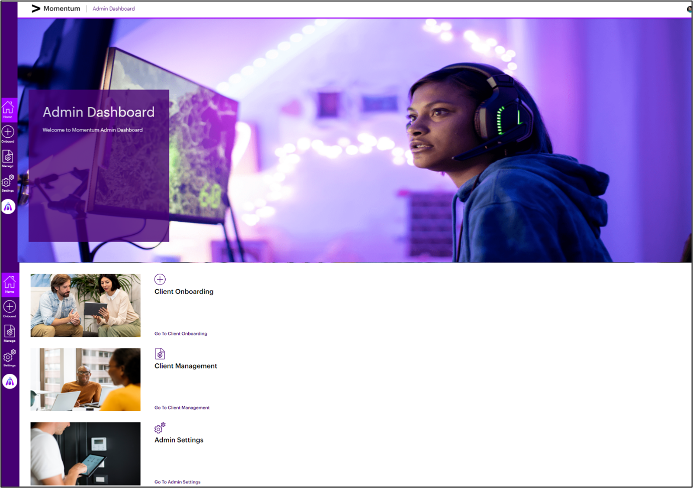
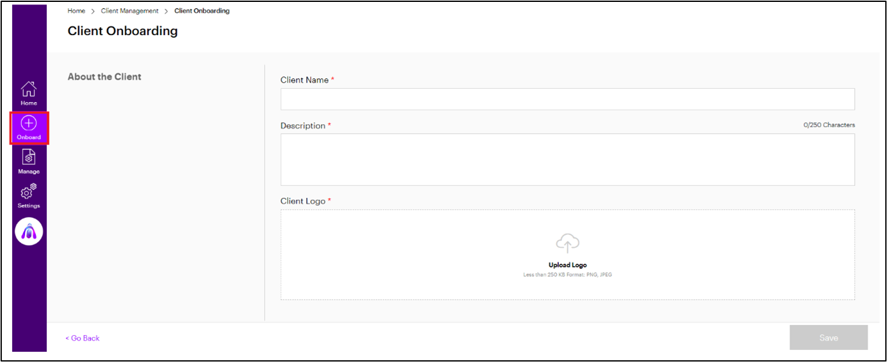
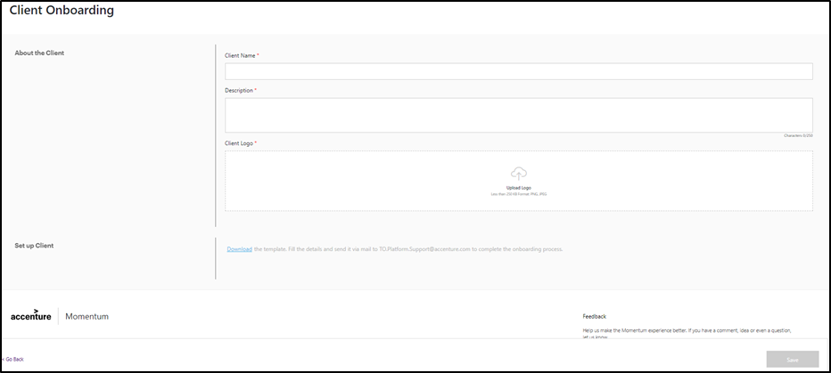
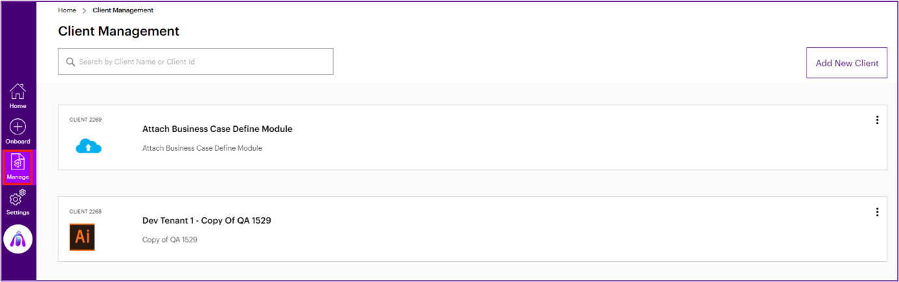
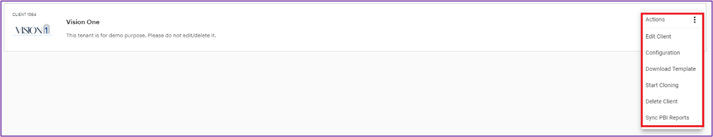

<style>
        table {
            width: 100%;
            border-collapse: collapse;
            table-layout: fixed;
            margin: 0 auto; /* Centers the table itself */
        }

        th, td {
            padding: 10px;
            border: 1px solid #ddd;
            text-align: left; /* Ensures left alignment */
            word-wrap: break-word;
        }

        th {
            background-color: #f2f2f2;
            font-weight: bold;
        }

        tr:nth-child(even) {
            background-color: #f9f9f9;
            word-wrap: break-word;
        }

        tr:hover {
            background-color: #e2e2e2;
        }
    </style>

# Welcome to Momentum Documentation

## Introduction

<p>
Accenture Momentum is a multi-tenant SaaS-based solution designed to drive the entire life cycle of a company's business transformation journey. It is built based on the five Programs of Accenture's transformation framework, describing a set of proven processes, tools, and methods to enable an end-to-end enterprise-wide transformation.
</p>
<p>
The Momentum solution includes an Admin Dashboard offering key capabilities to administer the Momentum client's onboarding, user access settings, and basic master configuration required to capture and manage the company's transformation data within Momentum. 
</p>

### Intended Audience

The Momentum Administrator Guide is intended for the Accenture Momentum Administrators (Momentum Support Team) to provide instructions on the Momentum administering activities.

### Prerequisites

- A Momentum user account with Admin user privilege.
- Recommended browser – Latest version of Google Chrome, Safari, and Microsoft Edge.
- To set up the company's transformation data onto the client's Momentum tenant account, the client must provide the content to customize the Future Vision and Landing Page with the company's transformation vision.

## Momentum Admin Dashboard

The Momentum Admin Dashboard allows the Admin users to:

<ul>
    <li>Onboard New Momentum Client(s)</li>
    <li>Define and manage Value Definition components (Strategic, Financial/Non-financial, and business Objectives, Value driver, and KPIs) </li>
    <li>Manage user and roles</li>
    <li>Manage business case offerings</li>
</ul>
<div class="note" style="background-color: #e7f4ff; padding: 10px; border-left: 5px solid #0078d4; margin-bottom: 20px;">
    <strong>Note:</strong>In a Momentum environment, the Admin users have full access to the Business Cases. The number of users with the Admin role is restricted (to a small number of justifiable circumstances) in compliance with the Client Date Protection standards and the least privilege access principles.
</div>
### Home
The Momentum Administration Home page includes the navigation links to different modules within the Momentum Administration.

Admin users can navigate to the respective module by clicking the module's icon displayed on the,

<ul>
    <li><strong>Home Page</strong>, or</li>
    <li><strong>Left Navigation Pane</strong></li>
</ul>
<div style="text-align: center;">
    <figcaption>Figure 1: Admin Home Page</figcaption>
    
</div>
```python
```
Admin users can navigate to the respective module by clicking the module's icon displayed on the,
The table below provides a list of modules within the Admin login.

| Modules  | Description                                                                                                              |
| -------- | ------------------------------------------------------------------------------------------------------------------------ |
| Onboard  | To add a new momentum client.                                                                                            |
| Manage   | To define & manage the client’s transformation and configuration data.                                                   |
| Settings | To set up and manage Value Definition (VD) components, Users & Roles, and Out-of-the-Box (OOTB) business case offerings. |

### Onboard

The Client Onboarding page allows the Administrator to onboard a new client onto the Momentum platform..

<div class="note">
    <strong>Navigation:</strong><br> <strong>Home page -> Onboard -> Client Onboarding </strong><br>
    Alternatively, users can scroll down on the <strong> Home </strong>page and click the<strong> Go To Client Onboarding</strong> link.
</div>

<div style="text-align: center;">
    <figcaption>Figure 2: Home Page – Client Onboarding</figcaption>
    
    <figcaption></figcaption>
</div>
```python
```
<div class="note" style="background-color: #e7f4ff; padding: 10px; border-left: 5px solid #0078d4; margin-bottom: 20px;">
    <strong>Note:</strong>The Momentum Support and Professional Services (PS) team members are authorized to create the Client Instance in the Momentum Production environment.
</div>
To onboard the client, follow the steps below:
<ol>
    <li> On the <strong>Client Onboarding</strong> page, enter values for the fields described below,</li>
    <br>
    <div style="text-align: center;">
    <figcaption>Figure 3: Client Onboarding Page</figcaption>
    
    <figcaption></figcaption>
    <br>
    <div style="background-color: #e7f4ff; padding: 10px; border-left: 5px solid #0078d4; margin-bottom: 20px;">
        <strong>Note:</strong> All fields marked with a red asterisk (*) are mandatory.
    </div>
    <table border="1">
        <thead>
            <tr>
                <th>Field/Section</th>
                <th>Description</th>
            </tr>
        </thead>
        <tbody>
            <tr>
                <td><strong>About the Client</strong> section</td>
            </tr>
            <tr>
                <td><strong>Client Name*</strong></td>
                <td>Enter the name of the client</td>
            </tr>
            <tr>
                <td><strong>Description</strong></td>
                <td>Enter a description of the client.</td>
            </tr>
            <tr>
                <td><strong>Client Logo</strong></td>
                <td>Click Upload Logo and select the required client logo. The logo must be in PNG or JPEG format. This logo can be easily changed or updated later using the Edit Client option. </td>
            </tr>
            <tr>
                <td><strong>Set up the Client</strong> section</td>
            </tr>
            <tr>
                <td><strong>Set up Client </strong></td>
                <td>Click the Download link to download the client onboarding Excel template.<br>
                Note: Momentum support no longer uses the practice of loading the client data into Momentum using this Excel template. The Client Admin (or) Professional Services (PS) Lead should use the Self-service EZ config module to configure the client data. This file can be used for reference.
                </td>
            </tr>
        </tbody>
    </table>
</div>
    <li>Click <strong>Save</strong>. <br>
        The client is added to the Momentum platform.
</li>
</ol>
Navigation: Home page  Manage 
### Manage
The Client Management page allows to manage the existing client's data on the Momentum platform.
<br>
<div style="text-align: center;">
    <figcaption>Figure 4: Administration Home Page – Client Management</figcaption>
    
    <figcaption></figcaption>
</div>
<br>
<div class="note" style="background-color: #e7f4ff; padding: 10px; border-left: 5px solid #0078d4; margin-bottom: 20px; text-align: left;">
    <strong>Navigation: </strong>Home page -> <strong>Manage </strong>
</div>
<p style ="text-align: left">
Click <strong> Manage </strong>to open the <strong>Client Management</strong> page.<br>
Select the required client and click the <strong>Kebab Menu</strong> (or) <strong>Ellipsis</strong> icon. The list of actions to manage the client data appears. Select the required option based on the requirement.
</p>
<div style="text-align: center;">
    <figcaption>Figure 5: Client Management Page</figcaption>
    
    <figcaption></figcaption>
</div>
<br>
#### Edit Client
<p>
   To modify existing client data added to the onboarding page,
<ol>
  <li>In the<strong> Client Management</strong> page, select the required client and click on the<strong> Ellipsis</strong> icon. </li>
  <li>Select the<strong> Edit Client</strong> option. The<strong> Client Onboarding</strong> page opens.</li>
  <li>Modify the required details, such as the client's description and logo.</li>
  <li>Click<strong> Update</strong> to save the changes</li>
</ol>
</p>

- `mkdocs new [dir-name]` - Create a new projects.
- `mkdocs serve` - Start the live-reloading docs server.
- `mkdocs build` - Build the documentation site.
- `mkdocs -h` - Print help message and exit.
- Checking two bullet point

[Release Notes](about.md)

## Project layout

    mkdocs.yml    # The configuration file.
    docs/
        index.md  # The documentation homepage.
        ...       # Other markdown pages, images and other files.
        img/
            screenshot.png
